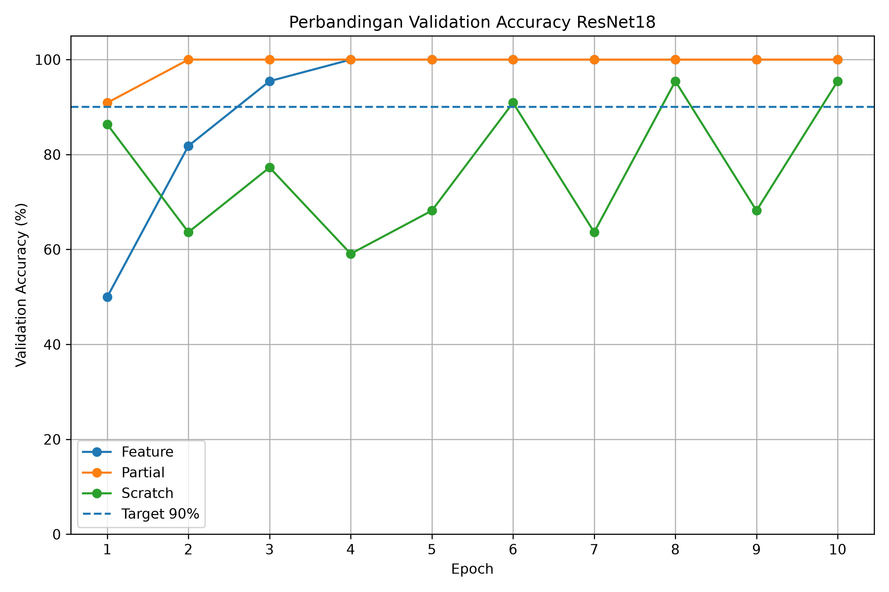
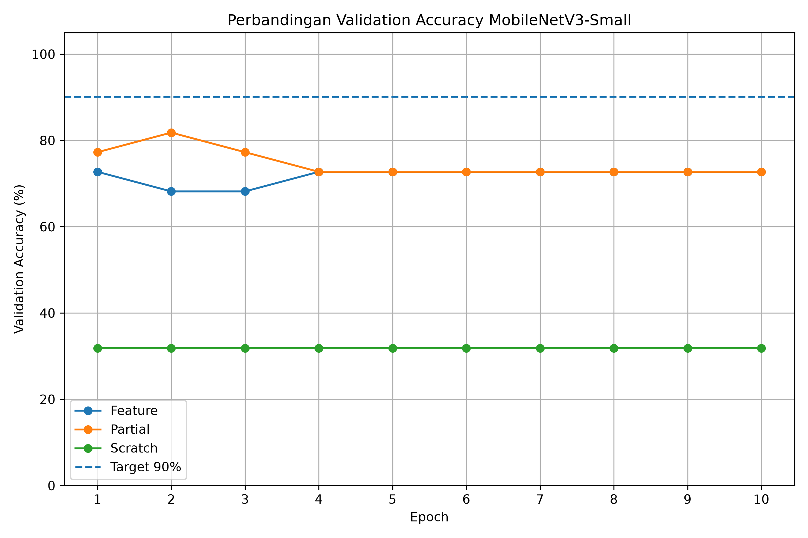
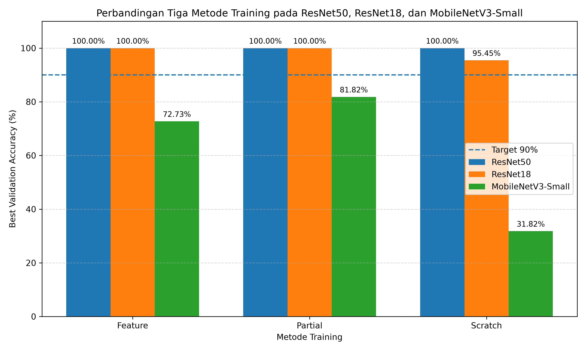
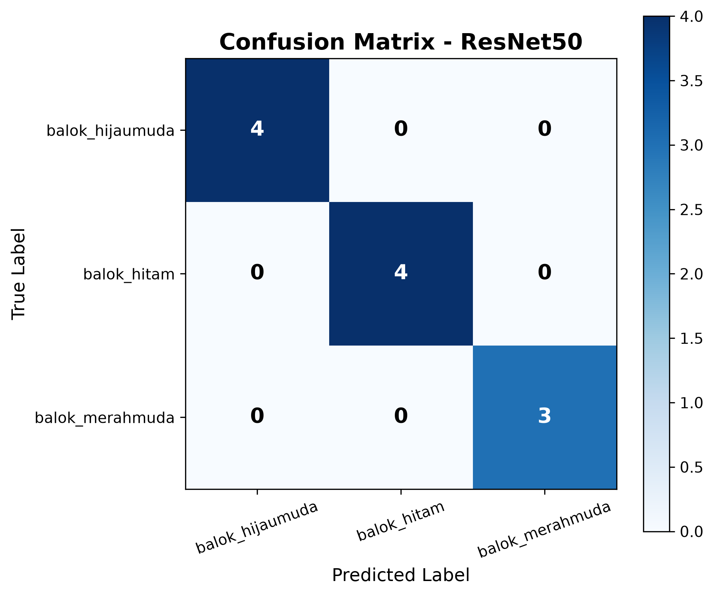
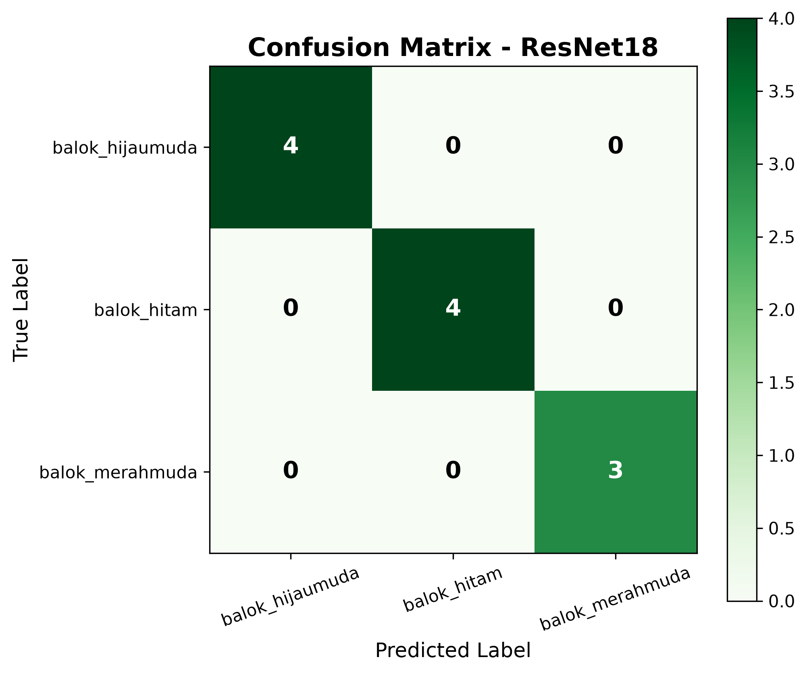
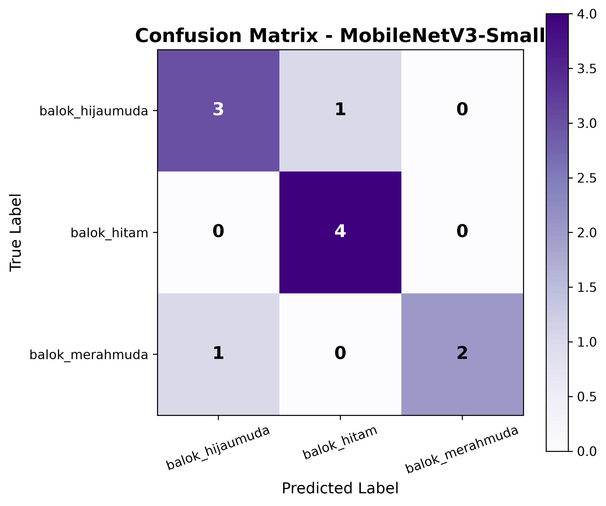

## 📈 Grafik Validation Accuracy ResNet50

  

## 📈 Grafik Validation Accuracy ResNet18

  

## 📈 Grafik Validation Accuracy MobileNetV3-Small

  

## 📊 Perbandingan Feature, Partial, dan Scratch

  

## 🧩 Confusion Matrix ResNet50

  

## 🧩 Confusion Matrix ResNet18

  

## 🧩 Confusion Matrix MobileNetV3-Small

  

