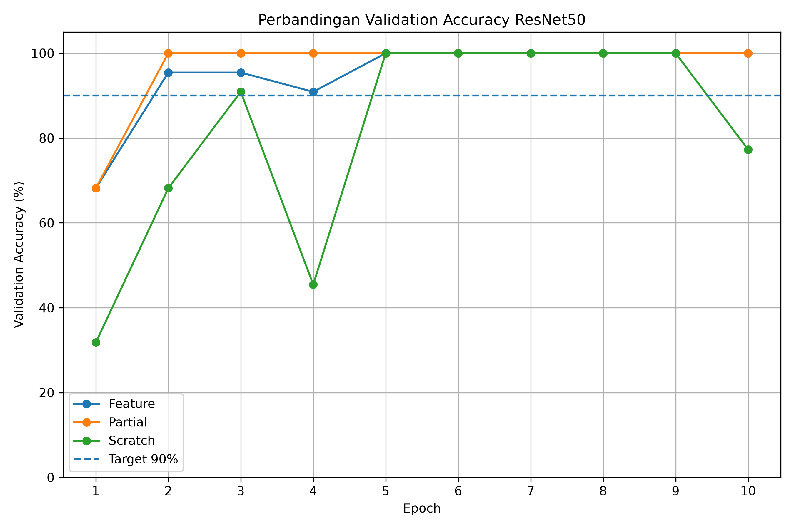

# Transfer Learning - Klasifikasi Balok 

<p align="center">
  <b>Perbandingan ResNet50, ResNet18, dan MobileNetV3-Small untuk klasifikasi objek balok pada sistem Pick and Place</b>
</p>

---

## 👩‍💻 Identitas

| Informasi | Keterangan |
|---|---|
| **Nama** | Mikha Shintia Sitorus |
| **NIM** | 4222401060 |
| **Program Studi** | Teknologi Rekayasa Robotika |
| **Model** | ResNet50, ResNet18, MobileNetV3-Small |
| **Jumlah Kelas** | 3 kelas |
| **Jumlah Dataset** | 110 citra |

---

# 📌 Deskripsi Project

Project ini merupakan bagian dari sistem **Arm Robot Pick and Place** yang memanfaatkan **Computer Vision dan Deep Learning** untuk mengenali jenis balok sebelum proses pengambilan dan pemindahan objek dilakukan.

Eksperimen membandingkan tiga arsitektur CNN:

- **ResNet50**
- **ResNet18**
- **MobileNetV3-Small**

Setiap arsitektur diuji menggunakan tiga strategi training:

| Mode | Bobot Awal | Bagian yang Dilatih | Learning Rate |
|---|---|---|---|
| **Feature** | ImageNet | Classifier / FC terakhir | `1e-3` |
| **Partial** | ImageNet | Feature block akhir + classifier | `1e-4` + `1e-3` |
| **Scratch** | Random | Seluruh parameter | `1e-3` |

Evaluasi dilakukan berdasarkan **validation accuracy, test accuracy, waktu training, confusion matrix, latency**, dan **FPS**.

---

# 🧱 Dataset

Dataset memiliki **3 kelas** dengan total **110 citra**.

| Label | Kelas | Jumlah |
|---:|---|---:|
| 0 | `balok_hijaumuda` | 37 |
| 1 | `balok_hitam` | 37 |
| 2 | `balok_merahmuda` | 36 |
| | **Total** | **110** |

## Pembagian Dataset

| Kelas | Train | Validation | Test | Total |
|---|---:|---:|---:|---:|
| balok_hijaumuda | 26 | 7 | 4 | 37 |
| balok_hitam | 26 | 7 | 4 | 37 |
| balok_merahmuda | 25 | 8 | 3 | 36 |
| **Total** | **77** | **22** | **11** | **110** |

Dataset telah diperiksa sebelum training:

- ✅ Duplikat file: **0**
- ✅ Data leakage antar split: **0**
- ✅ Total data: **110 citra**

> Test set terdiri dari 11 citra, sehingga satu kesalahan prediksi setara dengan perubahan accuracy sekitar 9,09%.

---

# 📁 Struktur Repository

```text
Computer-Vision-and-Deep-Learning/
│
├── dataset_raw/
│   ├── balok_hijaumuda/
│   ├── balok_hitam/
│   └── balok_merahmuda/
│
├── train/
│   ├── balok_hijaumuda/
│   ├── balok_hitam/
│   └── balok_merahmuda/
│
├── val/
│   ├── balok_hijaumuda/
│   ├── balok_hitam/
│   └── balok_merahmuda/
│
├── test/
│   ├── balok_hijaumuda/
│   ├── balok_hitam/
│   └── balok_merahmuda/
│
├── hasil/
│   ├── grafik_val_accuracy_resnet50.png
│   ├── grafik_val_accuracy_resnet18.png
│   ├── grafik_val_accuracy_mobilenetv3_small.png
│   ├── grafik_perbandingan_3_metode.png
│   ├── confusion_matrix_resnet50.png
│   ├── confusion_matrix_resnet18.png
│   └── confusion_matrix_mobilenetv3_small.png
│
├── metadata.csv
├── requirements.txt
├── .gitignore
└── README.md
```

---

# ⚙️ Konfigurasi Eksperimen

| Parameter | Nilai |
|---|---|
| Input Image | `224 × 224` |
| Batch Size | `8` |
| Epoch | `10` |
| Optimizer | Adam |
| Loss | CrossEntropyLoss |
| Device | CPU |
| Number of Classes | 3 |

Augmentasi training:

```python
RandomResizedCrop(224)
RandomHorizontalFlip()
ColorJitter(
    brightness=0.2,
    contrast=0.2,
    saturation=0.2,
    hue=0.1
)
```

---

# 📊 Hasil Training dan Evaluasi

## ResNet50

| Mode | Best Val Acc | Best Epoch | Epoch ≥90% | Training Time | Test Acc |
|---|---:|---:|---:|---:|---:|
| Feature | **100.00%** | 5 | 2 | 212.43 s | **100.00%** |
| Partial | **100.00%** | 2 | 2 | 231.06 s | 90.91% |
| Scratch | **100.00%** | 5 | 3 | 439.40 s | **100.00%** |

## ResNet18

| Mode | Best Val Acc | Best Epoch | Epoch ≥90% | Training Time | Test Acc |
|---|---:|---:|---:|---:|---:|
| Feature | **100.00%** | 4 | 3 | **80.40 s** | **100.00%** |
| Partial | **100.00%** | 2 | **1** | 103.24 s | **100.00%** |
| Scratch | 95.45% | 8 | 6 | 171.78 s | **100.00%** |

## MobileNetV3-Small

| Mode | Best Val Acc | Best Epoch | Epoch ≥90% | Training Time | Test Acc |
|---|---:|---:|---|---:|---:|
| Feature | 72.73% | 1 | Tidak tercapai | 32.42 s | **81.82%** |
| Partial | **81.82%** | 2 | Tidak tercapai | **26.15 s** | 63.64% |
| Scratch | 31.82% | 1 | Tidak tercapai | 50.71 s | 36.36% |

---

# 📈 Validation Accuracy

<table>
<tr>
<td align="center"><b>ResNet50</b></td>
<td align="center"><b>ResNet18</b></td>
<td align="center"><b>MobileNetV3-Small</b></td>
</tr>

<tr>
<td>

</td>

<td>

</td>

<td>

</td>
</tr>
</table>

### Perbandingan Tiga Metode

<p align="center">
  
</p>

Grafik menunjukkan bahwa **ResNet50 dan ResNet18 memiliki performa validation yang lebih konsisten**, sedangkan MobileNetV3-Small lebih sensitif terhadap strategi training.

---

# 🎯 Confusion Matrix

<table>
<tr>
<td align="center"><b>ResNet50</b></td>
<td align="center"><b>ResNet18</b></td>
<td align="center"><b>MobileNetV3-Small</b></td>
</tr>

<tr>
<td>

</td>

<td>

</td>

<td>

</td>
</tr>
</table>

### Hasil Test Model Terpilih

| Model | Benar | Total | Test Accuracy |
|---|---:|---:|---:|
| ResNet50 Feature | 11 | 11 | **100.00%** |
| ResNet18 Feature | 11 | 11 | **100.00%** |
| MobileNetV3-Small Feature | 9 | 11 | **81.82%** |

ResNet50 dan ResNet18 mampu mengklasifikasikan seluruh data test dengan benar. MobileNetV3-Small masih mengalami kesalahan pada beberapa citra kelas `balok_hijaumuda` dan `balok_merahmuda`.

---

# ⚡ Latency

Pengukuran latency dilakukan menggunakan:

- Batch size = `1`
- Input = `1 × 3 × 224 × 224`
- Warm-up = `10 inference`
- Measurement = `100 inference`
- Device = **CPU**

| Model | Mode | Average Latency | Median Latency | FPS | Test Accuracy |
|---|---|---:|---:|---:|---:|
| ResNet50 | Feature | 233.76 ms | 228.23 ms | 4.28 | **100.00%** |
| ResNet18 | Feature | **81.69 ms** | **81.16 ms** | **12.24** | **100.00%** |
| MobileNetV3-Small | Feature | **20.67 ms** | **20.36 ms** | **48.37** | 81.82% |

---

# 🔍 Analisis

### ResNet50

ResNet50 menghasilkan accuracy tinggi pada hampir seluruh skenario training. Feature extraction mencapai **100% validation dan 100% test accuracy**, tetapi memiliki latency paling besar yaitu **233,76 ms**.

Model ini memberikan kemampuan klasifikasi yang kuat, tetapi membutuhkan komputasi lebih tinggi dibandingkan dua arsitektur lainnya.

### ResNet18

ResNet18 memberikan keseimbangan terbaik antara **accuracy dan efisiensi komputasi**.

Pada mode feature:

- Validation accuracy = **100%**
- Test accuracy = **100%**
- Training time = **80,40 detik**
- Latency = **81,69 ms**
- FPS = **12,24**

ResNet18 mempertahankan accuracy ResNet50, tetapi memiliki inference yang jauh lebih cepat.

### MobileNetV3-Small

MobileNetV3-Small merupakan model paling ringan dan cepat.

Mode feature menghasilkan:

- Test accuracy = **81,82%**
- Latency = **20,67 ms**
- FPS = **48,37**

Kecepatan inferensinya jauh lebih tinggi, tetapi accuracy masih lebih rendah dibandingkan ResNet18 dan ResNet50.

Mode scratch hanya menghasilkan **31,82% validation accuracy**, menunjukkan bahwa dataset 77 citra training terlalu kecil untuk melatih model secara efektif dari awal.

---

# 🏆 Perbandingan Model Terpilih

| Model | Validation | Test | Latency | FPS |
|---|---:|---:|---:|---:|
| ResNet50 Feature | 100.00% | 100.00% | 233.76 ms | 4.28 |
| **ResNet18 Feature** | **100.00%** | **100.00%** | **81.69 ms** | **12.24** |
| MobileNetV3-Small Feature | 72.73% | 81.82% | **20.67 ms** | **48.37** |

**Interpretasi:**  
ResNet50 dan ResNet18 sama-sama mencapai test accuracy 100%, tetapi ResNet18 memiliki latency yang jauh lebih rendah. MobileNetV3-Small menjadi model tercepat dengan latency hanya 20,67 ms dan sekitar 48,37 FPS, namun akurasinya masih 81,82%. Berdasarkan hasil tersebut, ResNet18 Feature memberikan keseimbangan paling baik antara akurasi dan kecepatan inferensi pada eksperimen ini.

> **Insight utama:**  
> ResNet50 unggul pada kapasitas model, ResNet18 memberikan keseimbangan terbaik, sedangkan MobileNetV3-Small unggul pada kecepatan inferensi.

---

# ✅ Kesimpulan

Dari tiga arsitektur yang diuji, diperoleh trade-off antara **accuracy dan kecepatan inference**.

- **ResNet50** memberikan accuracy sangat tinggi tetapi memiliki latency terbesar.
- **ResNet18** menghasilkan **100% validation dan test accuracy** dengan latency yang jauh lebih rendah dibandingkan ResNet50.
- **MobileNetV3-Small** memiliki inference tercepat, tetapi accuracy belum menyamai kedua arsitektur ResNet.
- Transfer learning dengan bobot awal ImageNet memberikan hasil yang lebih konsisten dibandingkan training from scratch pada dataset kecil.

Berdasarkan hasil eksperimen, **ResNet18 dengan Feature Extraction merupakan kandidat utama untuk sistem Arm Robot Pick and Place**, karena memberikan keseimbangan yang baik antara accuracy dan kecepatan inferensi.

MobileNetV3-Small tetap potensial digunakan apabila kebutuhan utama sistem adalah **real-time inference** dan keterbatasan komputasi.

---

# 📝 Catatan

Dataset eksperimen hanya berjumlah **110 citra**, dengan test set sebanyak **11 citra**. Oleh karena itu, hasil accuracy yang tinggi belum dapat dianggap sebagai representasi performa pada seluruh kondisi dunia nyata.

Pengembangan berikutnya dapat dilakukan dengan:

- menambah jumlah dataset,
- meningkatkan variasi pencahayaan dan background,
- menambah variasi posisi serta rotasi balok,
- melakukan pengujian langsung menggunakan kamera pada Arm Robot,
- mengukur latency end-to-end dari kamera hingga keputusan klasifikasi.

---

<p align="center">
  <b>Arm Robot Pick and Place — Computer Vision & Deep Learning</b><br>
  Mikha Shintia Sitorus — 4222401060
</p>
